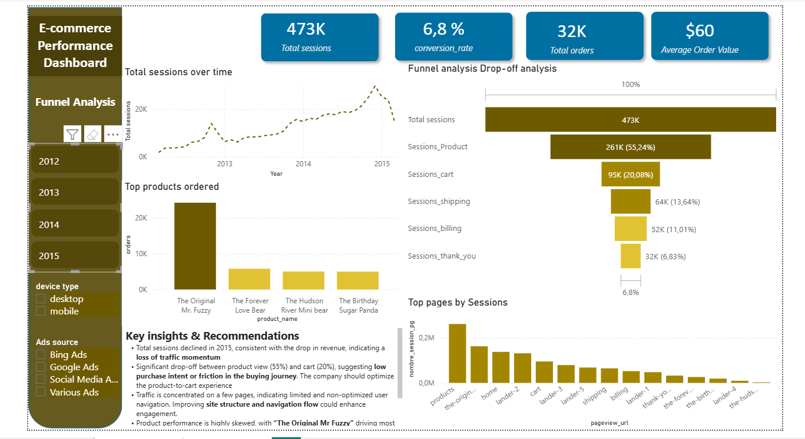
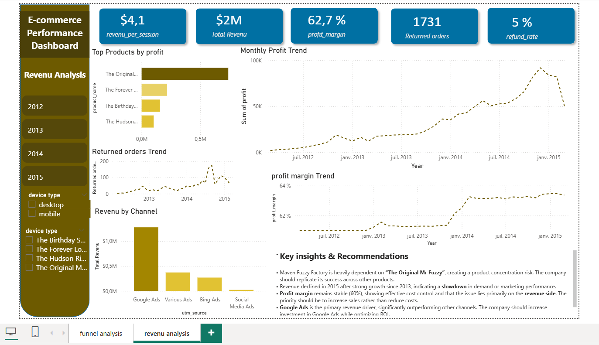

# 🔹 Maven Fuzzy Factory Analysis

End-to-end e-commerce analysis using SQL and Power BI to evaluate user behavior, conversion funnel, and revenue performance.

---

## 🔹 Project Overview

This project analyzes an e-commerce dataset from Maven Fuzzy Factory, a teddy bear retailer.  
The objective is to identify key business drivers, optimize the conversion funnel, and improve overall revenue performance.

---

## 🔹 Business Objectives

- Analyze website traffic and user behavior
- Evaluate conversion funnel performance
- Identify revenue drivers and product performance
- Detect growth opportunities and optimization areas

---

## 🔹 Tools & Technologies

- SQL (data extraction, cleaning, analysis)
- Power BI (dashboarding & visualization)

---

## 🔹 Key Analyses

- **Funnel Analysis** → Session → Product View → Cart → Purchase
- **Revenue Analysis** → Revenue trends, AOV, revenue per session
- **Product Performance** → Top-selling and most profitable products
- **Marketing Performance** → Traffic sources and campaign efficiency
- **KPI Tracking** → Conversion Rate, Average Order Value (AOV), Profit Margin

---

## 🔹 Key Insights

- 🔹 Decline in sessions and revenue in 2015 indicates weaker acquisition performance  
- 🔹 Significant drop-off between product view (~55%) and cart (~20%) suggests friction in the buying journey  
- 🔹 Strong dependency on a single product (“Mr Fuzzy”) highlights product concentration risk  
- 🔹 Google Ads is the primary revenue driver but requires optimization for efficiency  

---

## 🔹 Recommendations

- Improve product page experience to increase add-to-cart rate  
- Diversify product offering to reduce dependency on one product  
- Optimize marketing targeting and campaign segmentation  
- Enhance funnel tracking to identify user drop-off points  

---

## 🔹 Project Structure

- `queries.sql` → SQL queries used for analysis  
- `Maven_Fuzzy_Factory_Dashboard.pdf` → Power BI dashboard  

---

## 🔹 Dashboard Preview

---

## 🔹 About Me

Junior Data Analyst specialized in SQL & Power BI, focused on turning data into actionable business insights.
